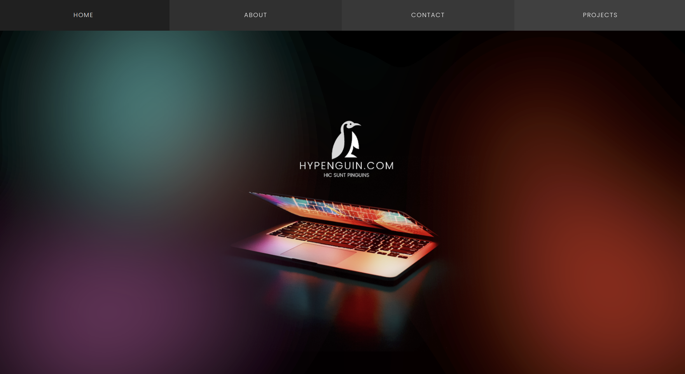
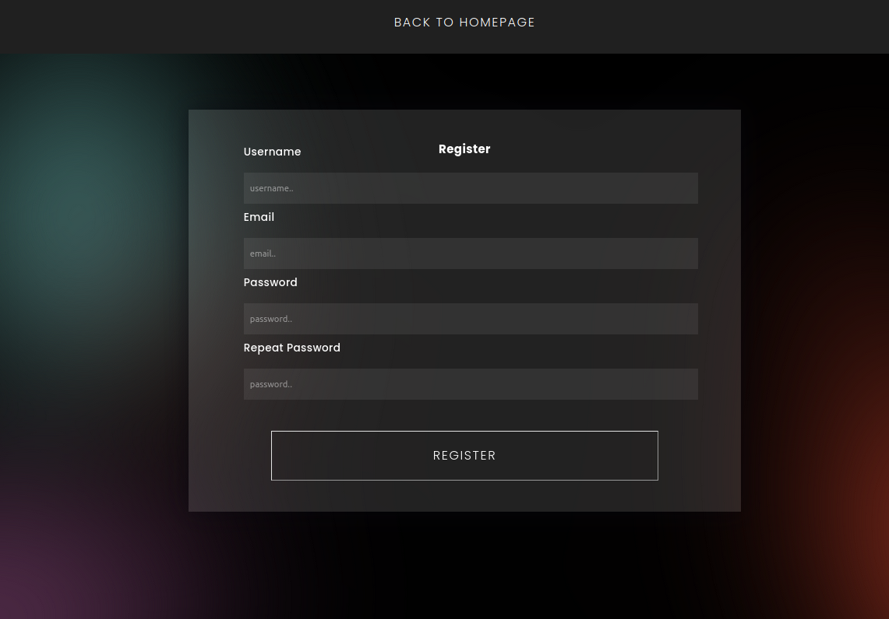
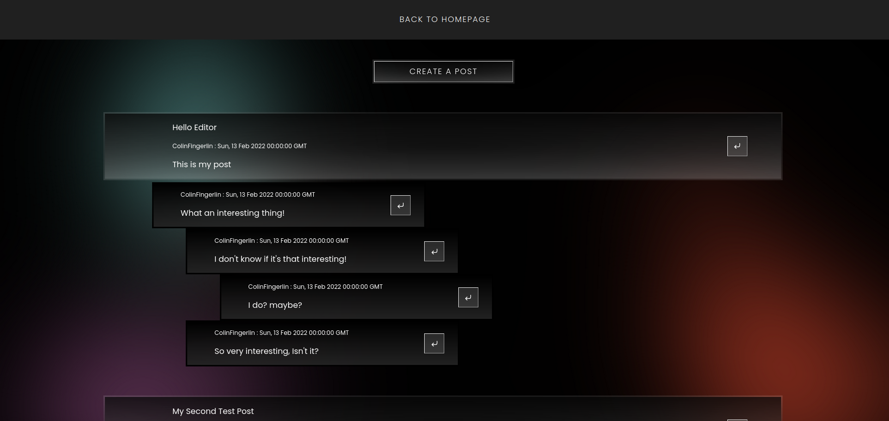
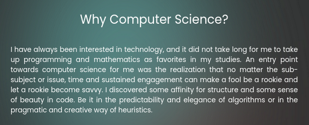

# Personal Website (WIP)

I'm building a website from the ground up, using the Flask module in python.

## Showcasing:

### The Index Page

### Registering & Login

### Forum

### Some example Text

